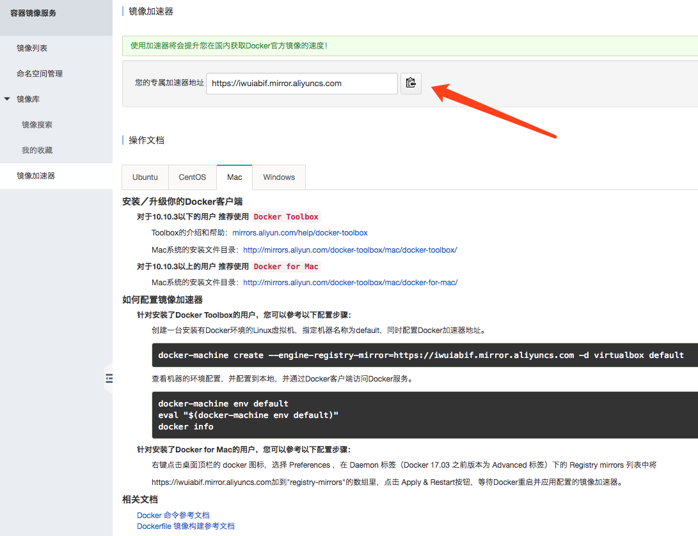
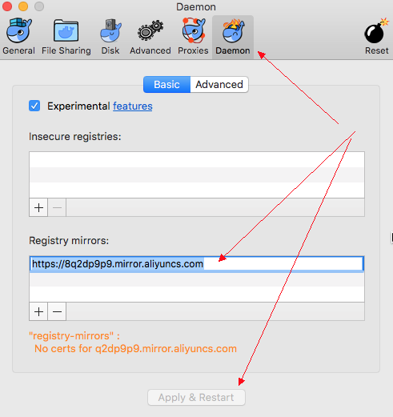

# Docker学习笔记

## 起步

> mac版下载地址：https://download.docker.com/mac/beta/Docker.dmg

### 检查Docker，Docker Compose和Docker Machine的版本
```docker
$ docker --version
$ docker-compose --version
$ docker-machine --version
```

### 基础命令

- `docker pull nginx` #下载镜像

- `docker images` #查看当前镜像名

- `docker ps -a` #查看当前运行的镜像

- `docker run nginx` #运行 nginx 镜像

- `docker stop {ID}` #停止该镜像

- `docker list` #列出本地镜像
 
- `docker rm {ID}` #在运行列表中删除镜像
 
- `docker rmi {ID}` #在本地镜像库中删除镜像

- `docker ps` #查看正在运行的容器

- `docker stop` #停止正在运行的容器

- `docker start` #启动容器

- `docker rm -f webserver` #移除正在运行的容器

## Docker 加速器
> 配置阿里云加速器

+ 访问 https://dev.aliyun.com/search.html 并注册 

+ 获取加速地址 https://iwuiabif.mirror.aliyuncs.com





## 入门
### 下载镜像并进入
```docker
#搜索镜像
docker search centos

#下载镜像
docker pull centos

#进入镜像
docker run -i -t centos /bin/bash
-t:在新容器内指定一个伪终端或终端。
-i:允许你对容器内的标准输入 (STDIN) 进行交互。

#退出
exit
```